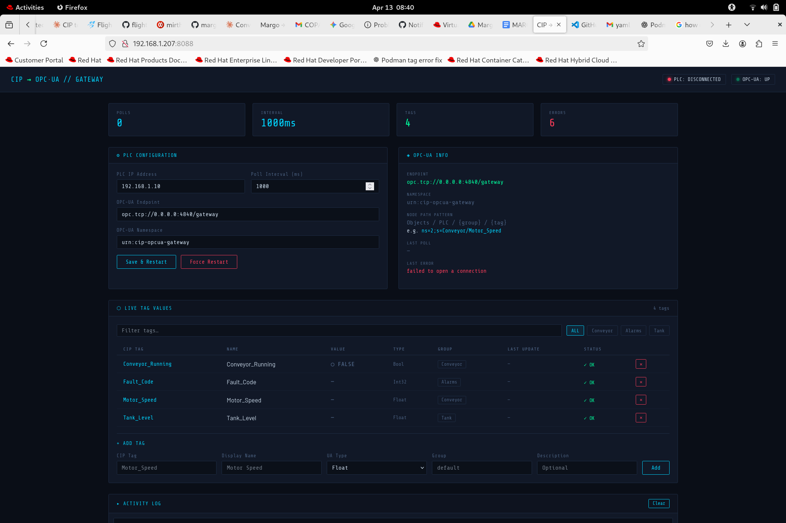
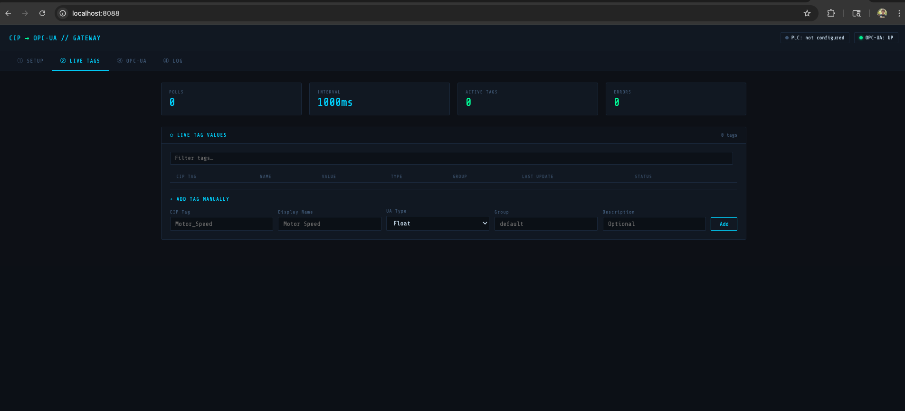
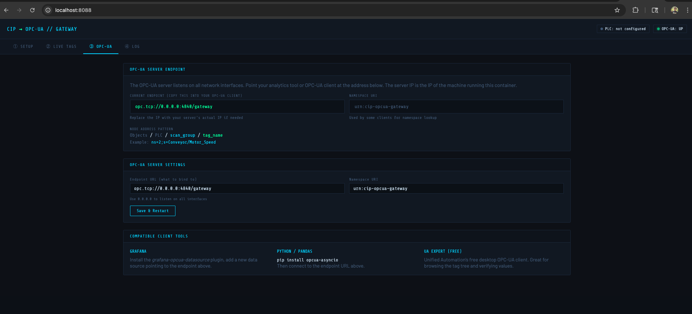
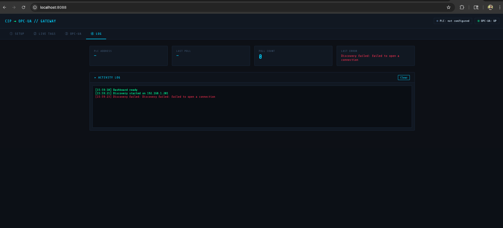

# CIP/EtherNet-IP → OPC-UA Gateway

Open-source, containerized gateway that reads tags from Rockwell
ControlLogix / CompactLogix PLCs via CIP/EtherNet-IP and exposes
them as an OPC-UA server for analytics tools.

**Stack:** `pycomm3` (CIP client) + `opcua-asyncio` (UA server)  
**Runtime:** Podman on RHEL 8/9, UBI9 base image  
**License:** MIT

---






## Architecture

```
┌─────────────────────┐        ┌────────────────────────────────────┐        ┌──────────────────┐
│  Rockwell PLC       │        │  cip-opcua-gateway (container)     │        │  Analytics Tool  │
│  ControlLogix /     │        │                                    │        │  (Grafana,       │
│  CompactLogix       │◄──────►│  pycomm3 (CIP explicit client)     │        │   Power BI,      │
│                     │        │      ↕ poll every N ms             │        │   Ignition,      │
│  EtherNet/IP        │        │  asyncua (OPC-UA server)           │◄──────►│   custom app)    │
│  Port 44818         │        │      port 4840                     │        │                  │
└─────────────────────┘        └────────────────────────────────────┘        └──────────────────┘
       OT Network                    (bridge host / DMZ)                         IT Network
```

---

## Prerequisites

- RHEL 8 or 9 with Podman >= 4.4
- Network connectivity from the gateway host to the PLC (TCP 44818)
- Network connectivity from analytics tool to the gateway host (TCP 4840)

---

## Quick Start

### 1. Build the image

```bash
make build
```

Or manually:
```bash
podman build -t cip-opcua-gateway:latest -f Containerfile .
```

### 2. Configure your tags

Edit `config/tags.json`:

```json
{
  "plc_address": "192.168.1.10",      ← Your PLC IP
  "plc_path": "1,0",                  ← Backplane path (slot 0 = most common)
  "poll_interval_ms": 1000,
  "tags": [
    {
      "name": "Motor_Speed",
      "cip_tag": "Motor_Speed",        ← Exact tag name from Studio 5000
      "ua_type": "Float",
      "description": "RPM",
      "scan_group": "Conveyor"
    }
  ]
}
```

**Supported `ua_type` values:** `Float`, `Double`, `Int16`, `Int32`, `Int64`,
`UInt16`, `UInt32`, `Bool`, `String`

**Tag name formats supported by pycomm3:**
- Simple: `"Motor_Speed"`
- Array element: `"Pressure[3]"`
- UDT member: `"Drive[0].OutputFrequency"`
- Program-scoped: `"Program:MainProgram.LocalTag"`

### 3. Run (interactive/dev)

```bash
make run
```

### 4. Run (production, detached)

```bash
make run-detached
make logs
```

### 5. Test the OPC-UA endpoint

Use any OPC-UA client. Quick Python test:
```bash
make test-ua
```

Or use the free **UaExpert** desktop client (Unified Automation) — connect
to `opc.tcp://<host-ip>:4840/gateway`.

---

## Deploying to an Air-Gapped / Offline RHEL Host

If the RHEL host has no internet access (no `dnf` repo reach, no container
registry), build the image on a connected machine and ship it over:

```bash
# On a Mac/Linux machine with internet + Podman:
podman build --platform linux/amd64 -t cip-opcua-gateway:latest -f Containerfile .
podman save cip-opcua-gateway:latest -o /tmp/cip-gateway.tar

# Copy to the RHEL host:
scp /tmp/cip-gateway.tar user@<rhel-host>:/tmp/

# On the RHEL host (as root or via sudo):
podman load -i /tmp/cip-gateway.tar
```

> **Note:** `podman save | ssh … podman load` also works to stream without a temp file.

---

## Systemd / Auto-Start on RHEL (Podman Quadlet)

Quadlet (Podman ≥ 4.4, RHEL 9+) generates a systemd service from the
`.container` file — no hand-written unit files needed.

```bash
# Install config and unit (run as root)
mkdir -p /etc/cip-opcua-gateway
cp config/tags.json /etc/cip-opcua-gateway/tags.json
chown 1500:1500 /etc/cip-opcua-gateway/tags.json   # must be writable by container user
chmod 644 /etc/cip-opcua-gateway/tags.json

cp systemd/cip-opcua-gateway.container /etc/containers/systemd/

systemctl daemon-reload          # triggers the Quadlet generator
systemctl start cip-opcua-gateway
```

> **Important — `systemctl enable` does not work for Quadlet units.**
> Quadlet-generated units live in `/run/systemd/generator/` (transient).
> Use `systemctl start`; boot persistence is handled automatically via
> `WantedBy=default.target` in the `[Install]` section.

Check status and logs:
```bash
systemctl status cip-opcua-gateway
journalctl -u cip-opcua-gateway -f
```

The Quadlet file is at [systemd/cip-opcua-gateway.container](systemd/cip-opcua-gateway.container).

### Common Quadlet pitfalls on RHEL 9 / Podman 4.9

| Symptom | Cause | Fix |
|---------|-------|-----|
| `Unit file does not exist` after `systemctl enable` | Quadlet units can't be enabled traditionally | Use `systemctl start` instead |
| Generator silently skips the file | Invalid key in `[Container]` section | `Memory=`, `CPUQuota=`, `Restart=`, `RestartSec=` belong in `[Service]`, not `[Container]` |
| `Invalid memory limit '256m'` | systemd requires uppercase suffixes | Use `MemoryMax=256M` |
| Container tries to pull image at start | Image only in rootless (user) store | Load image with `sudo podman load` so root's store has it |

---

## Network / Firewall

The container runs with **`Network=host`** so it shares the host's
network interfaces directly. This is required for:
- Correct OPC-UA endpoint advertisement (shows the real host IP, not the container bridge IP)
- Reliable CIP/EtherNet-IP connectivity (avoids Podman bridge NAT issues with EIP)

Open ports on the gateway host:

```bash
sudo firewall-cmd --permanent --add-port=4840/tcp   # OPC-UA
sudo firewall-cmd --permanent --add-port=8088/tcp   # Web UI
sudo firewall-cmd --reload
```

---

## SELinux Notes (RHEL)

The volume mount uses the `:z` flag which relabels the file for container
access. The config file must also be owned by UID **1500** (the `gateway`
user baked into the image) so the Web UI can save changes:

```bash
sudo chown 1500:1500 /etc/cip-opcua-gateway/tags.json
```

If you still get `Permission denied` after that:
```bash
sudo chcon -t container_file_t /etc/cip-opcua-gateway/tags.json
```

---

## OPC-UA Security (Production Hardening)

The default config uses `NoSecurity` for simplicity. To add
certificate-based auth in `gateway.py`:

```python
await server.load_certificate("server_cert.pem")
await server.load_private_key("server_key.pem")
await server.set_security_policy([
    ua.SecurityPolicyType.Basic256Sha256_SignAndEncrypt,
])
```

Generate a self-signed cert:
```bash
openssl req -x509 -newkey rsa:2048 -nodes \
  -keyout server_key.pem -out server_cert.pem -days 365
```

---

## PLC Path Reference (`plc_path`)

| Controller Location        | `plc_path` value |
|---------------------------|------------------|
| Local chassis, slot 0     | `"1,0"`          |
| Local chassis, slot 1     | `"1,1"`          |
| Remote chassis via ENBT   | `"1,0,A:B:C:D,1,2"` |
| CompactLogix (direct IP)  | leave as `"1,0"` |

---

## Environment Variables

| Variable           | Default                  | Description                    |
|--------------------|--------------------------|--------------------------------|
| `GATEWAY_CONFIG`   | `/config/tags.json`      | Path to tags config file       |
| `LOG_LEVEL`        | `INFO`                   | `DEBUG`, `INFO`, `WARNING`     |
| `PYTHONUNBUFFERED` | `1`                      | Ensures logs stream immediately|

---

## Connecting Analytics Tools

| Tool             | How to connect                                               |
|------------------|--------------------------------------------------------------|
| Grafana          | Install `grafana-opcua-datasource` plugin, point to port 4840|
| Power BI         | Use Matrikon or Prosys OPC-UA connector                     |
| Ignition         | Native OPC-UA client, add endpoint directly                 |
| Python / Pandas  | `opcua-asyncio` or `opcua` library                          |
| Node-RED         | `node-red-contrib-opcua` node                               |

---

## Project Structure

```
cip-opcua-gateway/
├── app/
│   ├── gateway.py          # Main application
│   └── requirements.txt    # Python dependencies
├── config/
│   └── tags.json           # Tag configuration (edit this)
├── systemd/
│   └── cip-opcua-gateway.container  # Podman Quadlet unit
├── Containerfile           # Multi-stage UBI9 build
├── Makefile                # Build / run shortcuts
└── README.md
```
